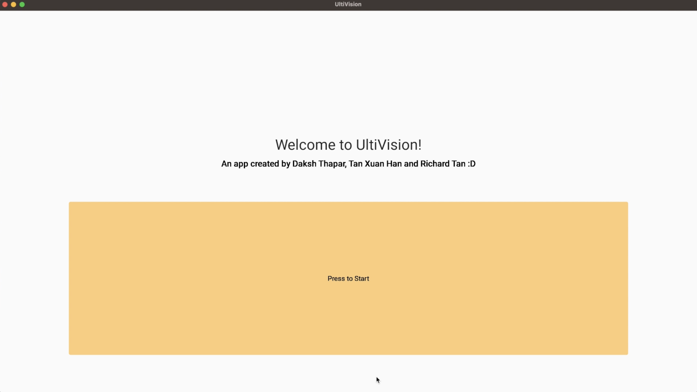
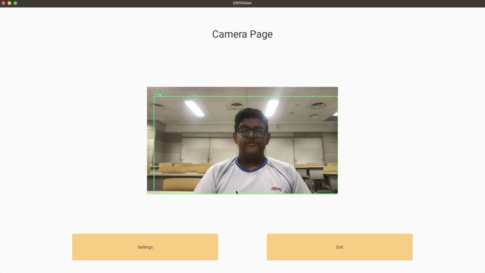
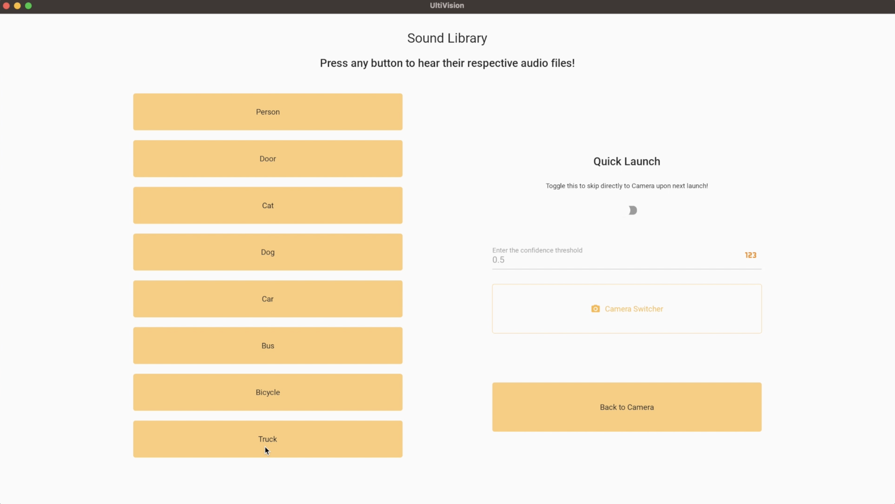

# About

UltiVision is a revolutionary leap forward in visual navigation for the visually impaired, making the world accessible for all. Powered by advanced Machine Learning algorithms, it uses computer vision to detect everyday objects like people, doors, vehicles, and animals.

By converting this visual information, such as distance and position information, into carefully tailored sounds, UltiVision enables users to quickly and efficiently visualise their surroundings. UltiVision bridges the gap between visual and auditory perception, and represents progress towards a more inclusive society.

# Screenshots

    
    
    

# Requirements

1. Install HomeBrew : `/bin/bash -c "$(curl -fsSL https://raw.githubusercontent.com/Homebrew/install/HEAD/install.sh)"`
2. Install protobuf with `brew install protobuf`
3. Install portaudio with `brew install portaudio`
- Python Version : `3.10.9`
- macOS Version `> 12.6.0` (Tested on macOS but may work on other platforms too)
- Use a x64 computer!

# Usage

> :warning: You need to use a virtual environment to run this project.

1. Create a virtual environment called `coursework-venv`: `python3 -m venv coursework-venv`

2. Activate the environment using: `source coursework-venv/bin/activate`

3. Install dependencies using `pip3 install -q -r requirements.txt`

4. Run the app using: `python3 main.py`

# Troubleshooting

- If you get an error saying `portaudio.h` not found, try running `brew install portaudio` and then run the app again.
- If you get an error saying `libportaudio.2.dylib` not found or something simliar, try running `brew install portaudio` and then run the app again.

# Additional information

The model training code can be found in the `model_training` folder.

# Credits

UltiVision was created by Tan Yu Zhe Richard (leader), Tan Xuan Han and Daksh Thapar and used for the 2022-2023 SST Computing+ Coursework.